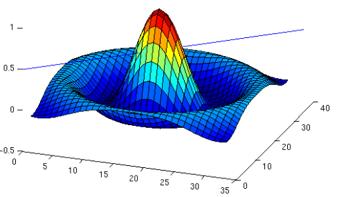

    

# Cálculo Numérico.

*Cálculo Numérico* es un repositorio que sirve de soporte para la asignatura de *Cálculo Numérico*.

 

## Desarrolladores.

* [Ing. Edgard Decena.](mailto:edecena@gmail.com)
* [Ing. Luís Acevedo.](mailto:laar@protonmail.com)

## Indice de contenido.

1. **Notebooks:**

    [En progreso]

1. **Guías de estudio:**
    <table style = "border:hidden">
        <tbody>
            <tr>
                <td>Guía 1:</td>
                <td>Objetivo General. Objetivos Específicos. Metodología. Contenido Programático.</td>
            </tr>
        </tbody>
    </table>

    1. [Guía 0:](guias/1_guia_calculo_numerico.pdf) Objetivo General. Objetivos Específicos. Metodología. Contenido Programático.
    1. [Guía 1:](guias/1_guia_calculo_numerico.pdf) Repaso de Cálculo Diferencial e Integral. Aritmética del Computador y el Error de Redondedo.
    1. [Guía 2:](guias/2_guia_calculo_numerico.pdf) Método de Bisección. Método de Regla Falsa. Método de Newton Raphson. Método de la Secante. Método de Iteración de Punto Fijo.
    1. [Guía 3:](guias/3_guia_calculo_numerico.pdf) Polinomio de Interpelación de Newton con Diferencias Divididas. Polinomio de Interpolación de Lagrange.
    1. [Guía 4:](guias/4_guia_calculo_numerico.pdf) Diferenciación Numérica.
    1. [Guía 5:](guias/5_guia_calculo_numerico.pdf) Integración Numérica. Regla del Trapecio. Regla de Simpson de Un Tercio. Regla de Simpson de Tres Octavos.
    1. [Guía 6:](guias/6_guia_calculo_numerico.pdf) Ecuaciones Diferenciales. Método de Euler. Método de Euler Mejorado. Método de Runge-Kutta de Orden 4.
    1. [Guía 7:](guias/7_guia_calculo_numerico.pdf) Métodos Directos Para Resolver Sistemas Lineales. Eliminación Gaussiana. Método de Gauss-Jordan. Método de Gauss-Seidel. 

1. **Bibliofrafía:**
    1. [Álgebra lineal con aplicaciones y Python.](libros/Libro_Algebra_Lineal_con_Aplicaciones_Python.pdf)
    1. [Numerical Methods in Engineering with Python 3.](libros/Libro_Jaan_Kiusalaas_2013_Numerical_Methods_in_Engineering_Python_3ed.pdf)

## Pre-requisitos.

El curso de *Cálculo Numérico* requiere ciertos **requisitos técnicos y cognoscitivos**:

1. **Requisitos técnicos:**
    1. Calculadora científica básica.
    1. Cuenta y repositorio en *GitHub*.

1. **Requisitos cognoscitivos:**
    1. [Tutorial Git.](https://github.com/ejdecena/tutorial_git)
    1. [Tutorial Python.](https://github.com/ejdecena/tutorial_python)
    1. [Tutorial Jupyter.](https://github.com/ejdecena/tutorial_jupyter)
    1. [Herramientas Python (NumPy, Matplotlib y SciPy).](https://github.com/ejdecena/herramientas_python)

## Contribuciones.

Este repositorio es de *código abierto*; lo que significa que cualquier persona interesada puede contribuir en él. Todas las contribuciones serán bienvenidas, incluyendo:

* Correcciones ortográficas.
* Nuevas figuras.
* Correcciones en el código *Python*, incluídas mejoras de estilo.
* Mejores ejemplos.
* Mejores explicaciones. 
* Correcciones de errores conceptuales.

La forma de contribuir es vía la interfaz web de *GitHub*, mediante peticiones de [*Pull requests*](https://github.com/ejdecena/tutorial_git/pulls), o reportando los problemas/bugs del repositorio por [*Issues*](https://github.com/ejdecena/tutorial_git/issues).